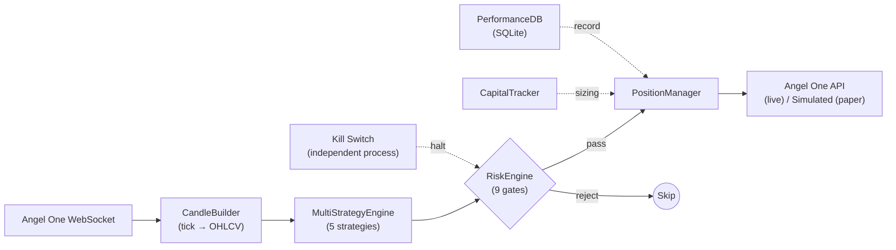
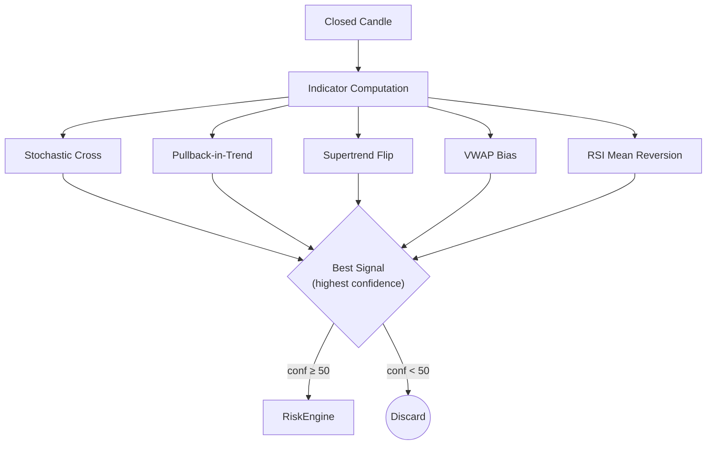
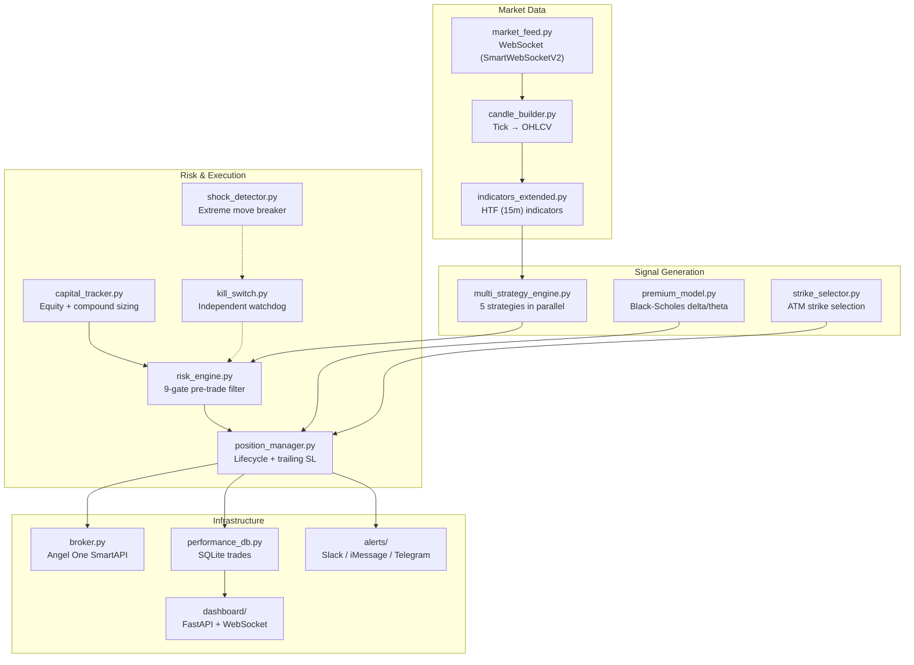
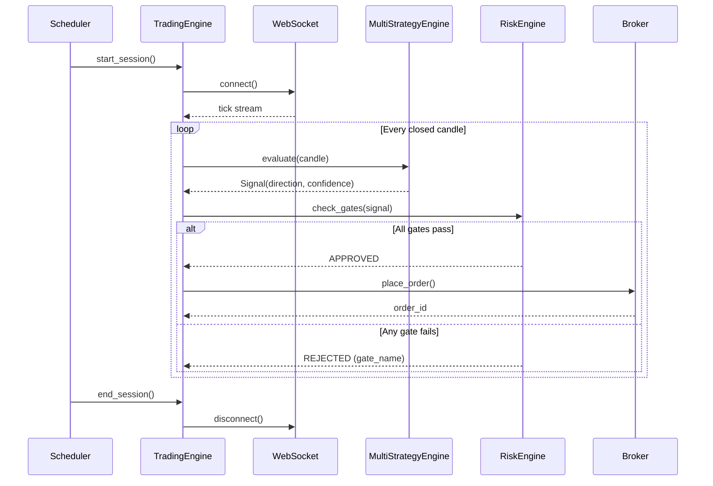

# Architecture

## Data Flow



## Strategy Pipeline



## System Components



## Trading Session Lifecycle



## Project Structure

```
deltaforge/
├── cli.py                        # CLI entry point (`df` command)
├── main.py                       # Python entry point
├── config/
│   ├── settings.py               # All parameters (env-overridable)
│   ├── logging.py                # Console + file + JSON logging
│   └── holidays.json             # NSE holiday calendar
├── engine/
│   ├── trading_engine.py         # Main trading loop
│   ├── multi_strategy_engine.py  # 5-strategy signal generator
│   ├── candle_builder.py         # Tick → OHLCV
│   ├── market_feed.py            # WebSocket feed
│   ├── premium_model.py          # Black-Scholes model
│   ├── indicators_extended.py    # HTF indicators
│   ├── broker.py                 # Angel One wrapper
│   └── strike_selector.py        # ATM strike selection
├── risk/
│   ├── risk_engine.py            # 9-gate filter
│   ├── capital_tracker.py        # Equity tracking + sizing
│   ├── kill_switch.py            # Watchdog process
│   └── shock_detector.py         # Circuit breaker
├── execution/
│   └── position_manager.py       # Position lifecycle
├── persistence/
│   └── performance_db.py         # SQLite trade DB
├── alerts/                       # Slack / iMessage / Telegram
├── automation/
│   └── daily_scheduler.py        # Session lifecycle
├── dashboard/                    # FastAPI + WebSocket UI
├── backtest/                     # 30+ analysis scripts
└── tests/                        # e2e, component, integration
```

## Key Design Decisions

**Single engine for all modes** — `MultiStrategyEngine` runs identically in backtest, paper, and live. No code divergence between test and production.

**File-based kill switch** — uses filesystem signals rather than IPC, so it works even when the main process is hung.

**Atomic capital state** — `capital.json` is written via tmp file + rename to prevent corruption on crash.

**Compound position sizing** — lot count scales with equity (1 lot per Rs 6,000 of deployable capital) but is throttled by drawdown tiers.

## Logging

| Sink | Format | Level | Location |
|------|--------|-------|----------|
| Console | Colored, human-readable | INFO | stderr |
| File | Timestamped, module/function/line | DEBUG | `logs/trading_YYYY-MM-DD.log` |
| JSON | Machine-parseable JSONL | DEBUG | `logs/json/trading_YYYY-MM-DD.jsonl` |

Daily rotation, 30-day retention, gzip compression. Thread-safe via `enqueue=True`.
