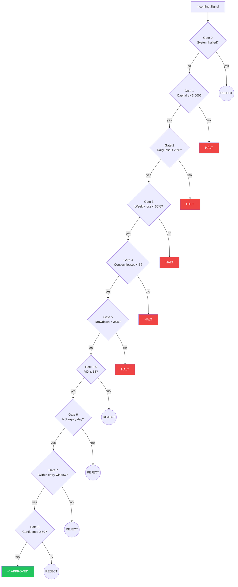
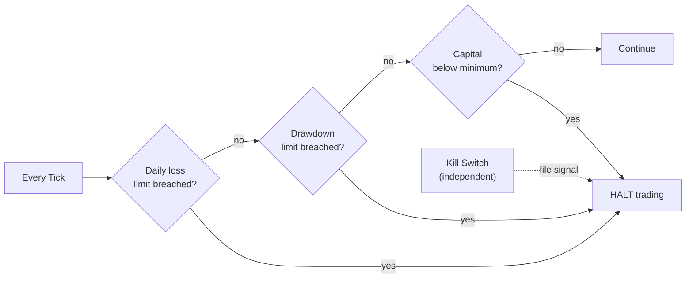
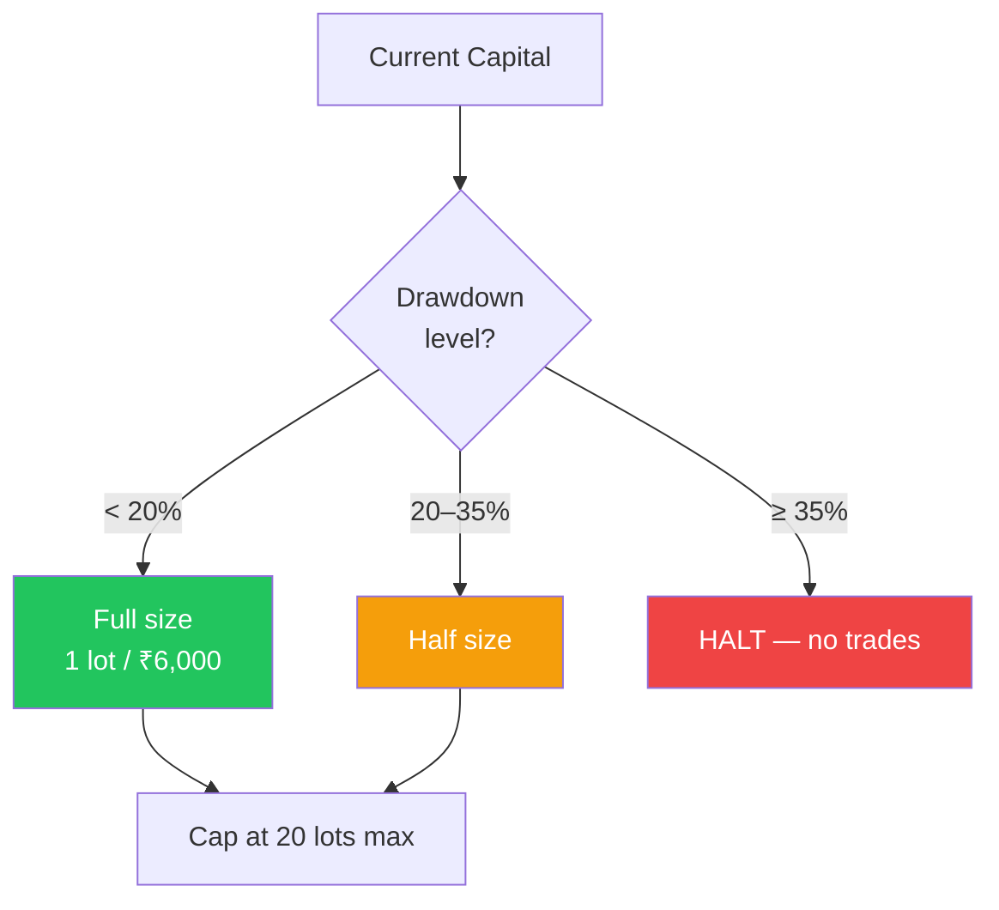
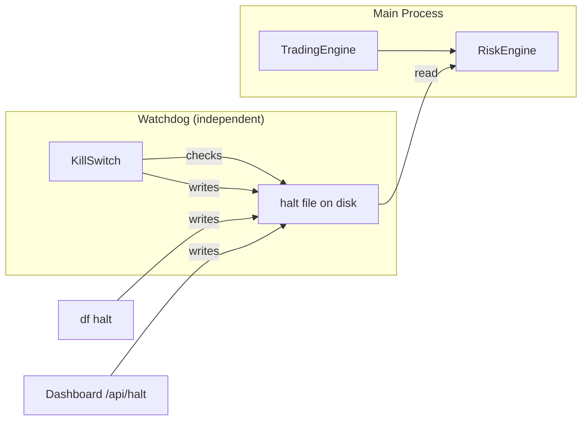

# Risk Management

DeltaForge implements a 3-layer risk model: pre-trade gates, real-time monitoring, and position sizing.

## Gate Flow

## Gate Reference

| Gate | Check | On Fail |
|------|-------|---------|
| 0 | System not halted | Reject |
| 1 | Capital ≥ ₹3,000 | **HALT** |
| 2 | Daily loss < 25% of day-start capital | **HALT** |
| 3 | Weekly loss < 50% of starting capital | **HALT** |
| 4 | Consecutive losses < 5 | **HALT** |
| 5 | Drawdown < 35% from peak | **HALT** |
| 5.5 | India VIX ≤ 18 | Reject |
| 6 | Not Nifty expiry day (if configured) | Reject |
| 7 | Within entry window | Reject |
| 8 | Signal confidence ≥ 50 | Reject |

**Reject** = signal skipped, system stays active. **HALT** = trading stopped for session.

## Real-Time Monitoring

## Position Sizing

- **Deploy ratio**: 60% of total capital is deployable
- **Lot sizing**: 1 lot per ₹6,000 of deployable capital
- **Max position**: 20 lots
- **Atomic state**: `capital.json` written via tmp + rename (crash-safe)

## Kill Switch

The kill switch is an independent process that monitors system health via file-based signaling.

Triggers:
- Automatic: drawdown or loss breaches
- Manual: `df halt`, dashboard toggle, or creating a halt file on disk
